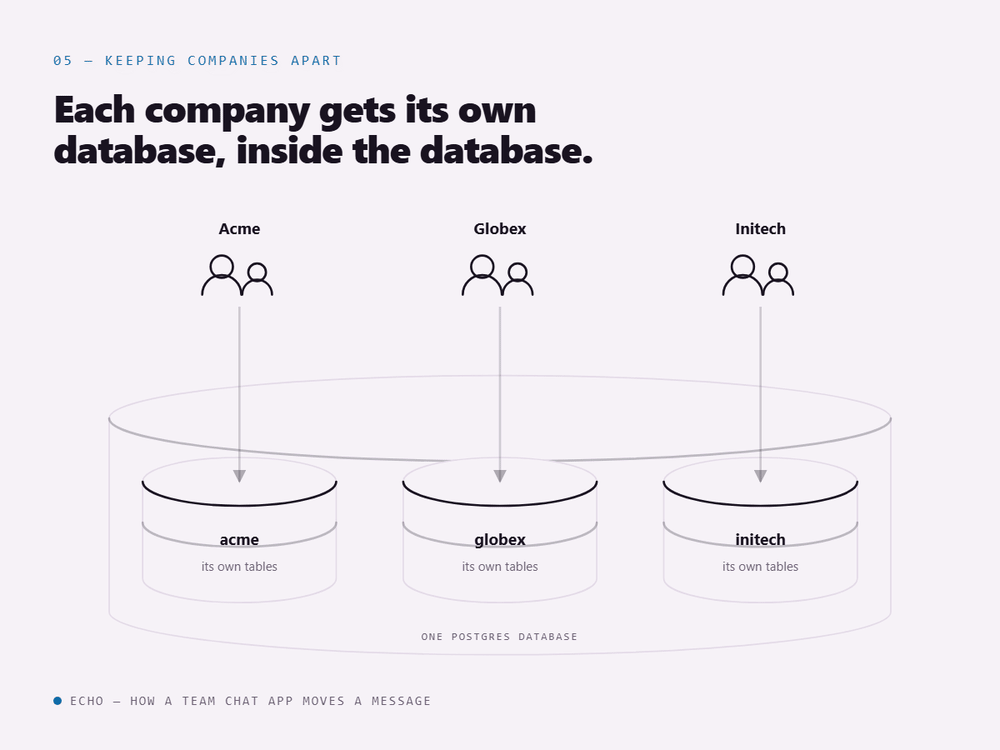
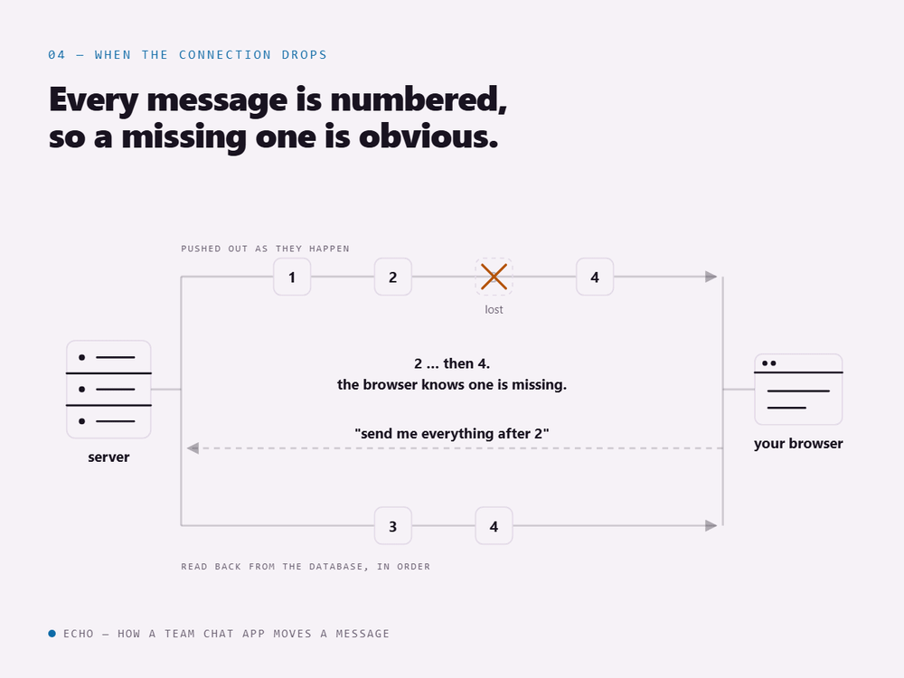
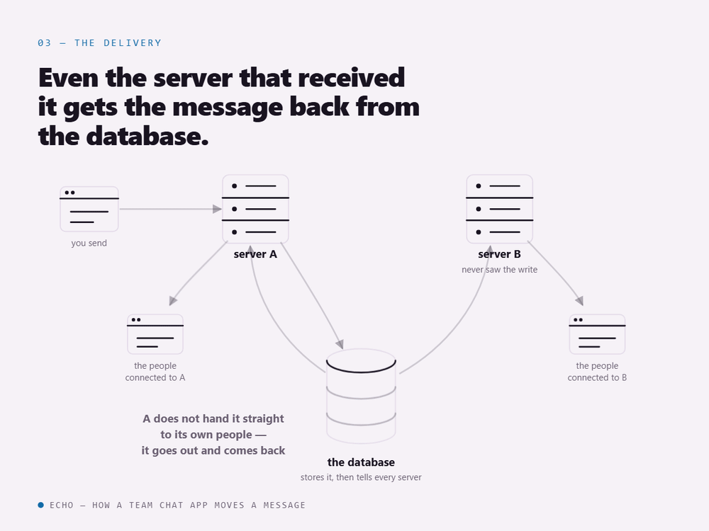

# Echo — a multi-workspace team chat app

A Slack-style chat application: workspaces, public/private channels, DMs and group DMs,
file attachments, live unread badges, read receipts, and a notification inbox.

This document explains **why the app is built the way it is** (the architecture decisions),
then walks through **how it actually works at runtime** — the session lifecycle between the
frontend and backend, the WebSocket layer, and the main end-to-end flows.

---

## 1. Tech stack at a glance

| Layer                     | Choice                                                                                  |
| ------------------------- | --------------------------------------------------------------------------------------- |
| Runtime / package manager | **Bun** (workspaces monorepo)                                                           |
| Backend                   | **Express 4** + TypeScript (ESM)                                                        |
| Database                  | **PostgreSQL** (`pg` pool + **Drizzle ORM** for the control plane, raw SQL for tenants) |
| Auth                      | **Better Auth** (sessions, OAuth, 2FA, admin plugin)                                    |
| Realtime                  | **`ws`** WebSocket server + **Postgres LISTEN/NOTIFY** backplane                        |
| Validation                | **Zod** (request DTOs, env vars, frontend forms)                                        |
| API docs                  | OpenAPI (zod-to-openapi) served by **Scalar** at `/api/docs`                            |
| Files                     | **S3** (private bucket, presigned PUT + signed-redirect GET)                            |
| Frontend                  | **React 18** + **Vite** + **React Router 7**                                            |
| Server state              | **TanStack React Query**                                                                |
| UI                        | **Tailwind CSS v4** + shadcn-style components (Radix primitives)                        |
| Tests                     | **Vitest** (server: integration against real Postgres; front: React Testing Library)    |

### Repo layout

```
echo/
├── echo-server/          # API + WebSocket server (also serves the built SPA in prod)
│   ├── src/
│   │   ├── app.ts        # Express app assembly (middleware order is load-bearing)
│   │   ├── server.ts     # process entrypoint: HTTP + WS + graceful shutdown
│   │   ├── config/       # zod-validated env
│   │   ├── infrastructure/
│   │   │   ├── auth/         # Better Auth instance
│   │   │   ├── database/     # control-plane (Drizzle) + tenant (search_path) clients
│   │   │   ├── realtime/     # protocol, hub, backplane, WS server
│   │   │   ├── storage/      # S3
│   │   │   ├── email/        # Resend / SMTP transports + templates
│   │   │   ├── provisioning/ # workspace → tenant schema creation
│   │   │   └── audit/        # auth_events log
│   │   ├── modules/      # feature slices: routes → controller → service → dto
│   │   └── shared/       # middleware, errors, logger, openapi registry
│   └── drizzle/          # control-plane migrations
├── echo-front/           # React SPA
│   ├── public/           # served at the root: favicon.svg (the site icon)
│   └── src/
│       ├── lib/          # apiFetch, authClient, realtime clients, query client
│       ├── features/     # feature slices: api/ (hooks) + components/ + realtime/
│       ├── components/   # layouts + UI primitives
│       └── routes/       # page components (code-split)
└── docs/                 # AUTH.md — auth deep-dive; media/ — architecture animations
```

---

## 2. Architecture decisions

### 2.1 One monorepo, one origin in production

`echo-server` and `echo-front` are Bun workspaces in a single repo.

In **development** they run as two processes on two ports (SPA on `:3000`, API on `:4000`),
so Vite's HMR works normally. In **production** the server serves the compiled SPA itself
(`serveSpa()` in [app.ts](echo-server/src/app.ts)) — the browser origin _is_ the API origin.

Why this matters: a single origin means the session cookie is same-site, there's no CORS
preflight on every call, and the WebSocket upgrade goes to the same host. Cross-origin dev
still works because CORS is configured with `credentials: true` and the cookie is
`SameSite=Lax`.

A second benefit of the monorepo: the frontend imports **types** from the server
(`@server/*` path alias) — the realtime wire protocol and the Better Auth config type are
shared at compile time. No server code ever ships in the browser bundle; these are
`import type` only, so they vanish at build. The wire contract can't silently drift.

### 2.2 Better Auth owns identity — we don't roll our own

All of authentication lives in [infrastructure/auth/auth.ts](echo-server/src/infrastructure/auth/auth.ts):
one `betterAuth({...})` config mounted at `/api/auth/*`. It gives us, out of the box:

- email + password, with a minimum length and **Have I Been Pwned** breach checking
- Google and GitHub OAuth (each registered only if its credentials are in env — an
  unconfigured provider simply isn't registered, so local dev boots fine)
- TOTP two-factor, session list/revoke, password reset, email verification, change email,
  delete account
- an **admin plugin** (ban / set role / impersonate / list sessions) powering `/admin`
- **Cloudflare Turnstile** CAPTCHA on sign-up / sign-in / reset (again, only when the secret
  is configured)
- per-endpoint **rate limiting** (100 req/10s globally; 20/min on sign-in and TOTP verify,
  20/hour on sign-up and password reset)

Better Auth writes to _our_ Postgres tables through its Drizzle adapter — `users`,
`sessions`, `accounts`, `verifications`, `twoFactors` (mapped in
[control/schema.ts](echo-server/src/infrastructure/database/control/schema.ts)). So identity
data is not in a third-party service; it's in the same database as everything else and can be
joined against.

**Decision: no cookie cache.** Better Auth can cache the session in a signed cookie so that
`getSession()` skips the DB. We turned that off deliberately. With a cache, a session revoked
on another device kept "working" for up to 5 minutes, and the frontend (which thought it was
logged in) fought the API (which returned 401) in a redirect loop. Without it, every session
check is database truth and revocation takes effect on the very next request.

**Decision: manual-only account linking for unverified locals.** If someone signs up with
`victim@example.com` + a password they control, and the real owner later signs in with
Google, auto-linking would hand the attacker's row to the victim. Better Auth's
`requireLocalEmailVerified` guard blocks that; the recovery path is "sign in with your
password, then connect Google from Account settings" — which proves ownership under an
authenticated session.

### 2.3 Multi-tenancy: schema-per-workspace (the "bridge" model)

Data is split into two planes:

| Plane             | Where                                                              | What lives there                                                                                                                |
| ----------------- | ------------------------------------------------------------------ | ------------------------------------------------------------------------------------------------------------------------------- |
| **Control plane** | `public` schema, accessed via Drizzle                              | users, sessions, accounts, workspaces, memberships, invite tokens, notifications, preferences, `tenant_catalog`, auth audit log |
| **Tenant plane**  | one `tenant_<slug>` schema **per workspace**, accessed via raw SQL | channels, channel_members, messages, message_revisions, attachments                                                             |

<picture>
  <source media="(prefers-color-scheme: dark)" srcset="docs/media/echo-figure-5-dark.gif">
  
</picture>

Creating a workspace runs [provisionWorkspace()](echo-server/src/infrastructure/provisioning/workspace.ts)
— a **single Postgres transaction** that inserts the workspace row, inserts the creator's
admin membership, `CREATE SCHEMA`, runs
[tenant/init.sql](echo-server/src/infrastructure/database/tenant/init.sql) inside it, and
registers it in `tenant_catalog`. Because DDL is transactional in Postgres, a failure at any
step rolls back cleanly — no half-provisioned workspaces, no compensating cleanup jobs. (This
is the key reason schema-per-tenant beat database-per-tenant here: `CREATE DATABASE` can't
participate in a transaction.)

Every tenant read/write goes through one function,
[withTenantSchema()](echo-server/src/infrastructure/database/tenant/client.ts):

```ts
await withTenantSchema(workspaceId, async (db) => {
  // `search_path` is pinned to tenant_<slug> for this transaction only
  await db.query(`SELECT ... FROM messages WHERE ...`);
});
```

It resolves the schema name (cached), opens a transaction, does `SET LOCAL search_path`, and
releases the connection afterwards. `SET LOCAL` expires with the transaction, so a pinned
path can never bleed into the next request that borrows the same pooled connection. Schema
names are re-validated against `/^tenant_[a-z0-9_]+$/` before interpolation, since
identifiers can't be parameterized.

Tenant DDL is versioned by hand: `TENANT_SCHEMA_VERSION` + numbered files + a
`db:migrate-tenants` script that walks every workspace. Control-plane DDL uses drizzle-kit
migrations.

### 2.4 Backend structure: thin routes, thick services

Each feature is a module folder under `src/modules/<feature>/` with the same shape:

```
<feature>.routes.ts       # URL table + which middleware guards each route
<feature>.controller.ts   # req/res plumbing only — no business logic
<feature>.service.ts      # the actual logic + all SQL
<feature>.dto.ts          # zod schemas for body/query/params (also feed OpenAPI)
```

Authorization is **layered as middleware**, so it can't be forgotten per-route:

| Guard                                         | Question it answers                                                             | Where                                                     |
| --------------------------------------------- | ------------------------------------------------------------------------------- | --------------------------------------------------------- |
| `authenticate`                                | Is there a valid session? → sets `req.user`                                     | mounted per route family in `app.ts`                      |
| `loadWorkspace`                               | Is this user a member of `:workspaceId`? → sets `req.workspace` (role, isOwner) | `workspacesRouter.use('/:workspaceId', …)`                |
| `requireWorkspaceRole('admin')`               | Is the member an admin?                                                         | per-route                                                 |
| `assertChannelMember` / `assertChannelAccess` | May this user see _this channel_?                                               | inside services (also used by the WS `subscribe` handler) |

Because channels, DMs, members and invites are all mounted **under**
`/api/workspaces/:workspaceId/…`, they inherit the membership check for free:

```
/api/workspaces/:workspaceId/channels/:channelId/messages
/api/workspaces/:workspaceId/dms
/api/workspaces/:workspaceId/members
/api/workspaces/:workspaceId/invites
```

Routes that are deliberately **not** workspace-scoped sit outside that wall: the notification
inbox and UI preferences (user-global, cross-workspace), and invite acceptance (the invitee
isn't a member yet — `GET /api/invites/:token` is even public so a logged-out invitee can
read it before signing up).

Errors are normalized: services throw typed `AppError` subclasses (`NotFoundError`,
`ForbiddenError`, `ConflictError`, …) carrying a stable string `code`; a single
`errorHandler` at the end of the middleware chain turns them into
`{ error: { code, message, issues? } }`. The frontend's `ApiError.code` mirrors it, so UI can
branch on `slug_taken` or `account_not_linked` without string-matching prose.

### 2.5 Realtime: REST is the truth, WebSocket is only an accelerator

This is the single most important decision in the app.

**Writes never travel over the socket.** Sending, editing and deleting a message are all
plain REST calls. The socket is a one-way push channel that says "something changed" — and
it is explicitly allowed to drop, duplicate, or reorder frames without corrupting anything.

The mechanism that makes that safe is a **per-channel change clock**:

- `channels.last_seq` — a monotonic counter bumped on _every_ message create/edit/delete
- `messages.seq` — the clock value at insert (immutable → stable ordering + history paging)
- `messages.updated_seq` — the clock value at the last mutation (the reconciliation key)

Every write happens inside a tenant transaction that first takes a row lock on the channel
(`SELECT 1 FROM channels WHERE id = $1 FOR UPDATE`). That serializes concurrent writers for
that channel, which makes the sequence **gapless** — and gaplessness is what lets a client
detect that it missed something:

```
event.updatedSeq === lastClock + 1   → apply it, advance the clock
event.updatedSeq <= lastClock        → already seen, drop it (dedupe)
event.updatedSeq >  lastClock + 1    → GAP → fetch GET …/messages?since=<lastClock>
```

<picture>
  <source media="(prefers-color-scheme: dark)" srcset="docs/media/echo-figure-4-dark.gif">
  
</picture>

Sends are also **idempotent**: the client generates a `clientId` UUID, and
`(channel_id, client_id)` is unique. A retried send returns the existing row without burning
a sequence number, so an optimistic UI and a flaky network can't produce duplicates.

The broadcast is fired _after_ the transaction commits. If the broadcast fails entirely, the
message is still durable and every client heals on its next catch-up or reconnect.

### 2.6 Backplane: Postgres LISTEN/NOTIFY, not Redis

One Node process only holds its own sockets. Behind a load balancer, an event created on
instance A has to reach subscribers on instance B. Rather than add Redis, the
[backplane](echo-server/src/infrastructure/realtime/backplane.ts) rides Postgres
`LISTEN`/`NOTIFY` — infrastructure we already run.

- Publishing goes through the **pool** (`SELECT pg_notify($1, $2)`), so it never depends on
  the LISTEN connection's state. Fan-out to N recipients is one round-trip via
  `unnest($1::text[], $2::text[])`.
- Listening uses a **dedicated client** that reconnects and re-`LISTEN`s automatically.
- Channel names are opaque strings — `rt_ws_<workspaceId>` and `rt_user_<userId>` — validated
  against a regex before being quoted into `LISTEN` (identifiers can't be parameterized).
- `pg_notify` payloads are capped by Postgres at 8 KB; the backplane refuses anything over
  `MAX_PAYLOAD_BYTES = 7900` to stay clear of it. Oversized events are **skipped with a warning**
  rather than throwing — clients just catch up over REST. This is only viable _because_ of
  the seq design in 2.5.

`Backplane` is an interface, so swapping in Redis later touches one file and nothing else.

Note the loopback design: the hub never delivers an event directly to its own local sockets.
It publishes to the backplane, and the instance's own `LISTEN` subscription delivers it back.
One path in, one path out — so there's no chance of double-sending locally.

<picture>
  <source media="(prefers-color-scheme: dark)" srcset="docs/media/echo-figure-3-dark.gif">
  
</picture>

### 2.7 Two sockets, on purpose

| Socket               | Path                | Scope                                      | Carries                                                                                                                      |
| -------------------- | ------------------- | ------------------------------------------ | ---------------------------------------------------------------------------------------------------------------------------- |
| **Workspace**        | `/ws?workspaceId=…` | one workspace, subscribes to open channels | `message.created/updated/deleted`, `channel.read`, `typing`, `presence.changed`, roster + channel-lifecycle events           |
| **Awareness (user)** | `/ws/user`          | the signed-in user, cross-workspace        | `unread.bump`, `notification.created`, and targeted `workspace.deleted` / `channel.added` / `channel.removed` / `dm.created` |

Why split them? Unread badges and notifications must work **where you aren't** — on the
dashboard, or while you're in a different workspace, neither of which holds a workspace
socket. The awareness socket is mounted once under `RequireAuth` and survives all navigation;
the workspace socket is mounted with `key={workspaceId}` so switching workspaces tears one
down and builds another.

A direct consequence: unread counting is owned **exclusively** by the awareness socket. The
channel stream deliberately does _not_ bump unread, or an open channel would double-count.

### 2.8 Files: private bucket, presigned upload, signed-redirect download

Attachments and avatars live in a private S3 bucket under a `echo/` namespace. Two hops:

1. **Upload** — the client asks for a presigned `PUT` (bound to the declared content-type and
   size, at a server-generated key scoped to `workspace/channel/user`), then uploads the bytes
   straight to S3. The API never proxies file bytes.
2. **Trust boundary at send time** — when the message is posted with those keys,
   `resolveAttachmentsForSend` re-checks key ownership, issues a **HEAD** to read the object's
   _real_ content-type and size, and re-validates against policy. The client cannot spoof
   metadata; a bad or incomplete upload fails the send before any row is written.
3. **Download** — the stored `url` is a stable pointer at `GET /api/files?key=…`, which 302s
   to a freshly-signed, short-lived S3 GET. Stored/cached message rows therefore never expire,
   and the bucket is never public. That endpoint is unauthenticated by design (an `` tag
   can't send a cross-origin cookie) — the namespaced, UUID-bearing key is the bearer token,
   and the endpoint refuses to sign anything outside `echo/`.

Per-category size limits (image/video/audio/document/file) and the per-message count cap come
from env, so a deploy can tune them without a code change.

### 2.9 Frontend: React Query is the only state store

There is no Redux/Zustand global store. Server state lives in React Query; UI state lives in
component state or small contexts (workspace, realtime client, page title, appearance).

Each feature owns a `api/` folder of hooks (`use-messages`, `use-channels`, `use-invites`, …)
built on one primitive, [apiFetch](echo-front/src/lib/api.ts), which adds four things:
base URL, `credentials: 'include'`, JSON serialization + typed error throwing, and a global
`auth:unauthorized` event on any 401.

Realtime never touches components directly — it writes into the **same** React Query cache
the REST hooks read (`qc.setQueryData`). So a message that arrives over the socket and a
message that arrives from a refetch land in exactly one place, merged by the same
`mergeMessage` function. Components just render a query result and don't know or care which
transport filled it.

Routing is a nested layout tree where guards are layout routes (`RequireAuth`,
`RequireAdmin`) rendering `<Outlet/>`, so an entire subtree is gated in one place. Pages are
code-split via `lazyRoute`.

### 2.10 Configuration is validated at boot

Both sides parse `process.env` / `import.meta.env` through a Zod schema at import time
([server](echo-server/src/config/env.ts), [front](echo-front/src/config/env.ts)). A missing
or malformed variable crashes at startup with a clear message instead of failing deep inside
a request six hours later.

Optional integrations degrade gracefully rather than blocking boot: no email transport →
emails print to the console; no S3 → uploads 501; no OAuth credentials → that provider isn't
registered; no Turnstile secret → no CAPTCHA.

Email specifically picks its transport by precedence, all three resolved at boot in
[email-service.ts](echo-server/src/infrastructure/email/email-service.ts): `RESEND_API_KEY`
set → Resend's HTTP API; else `SMTP_HOST` set → nodemailer over SMTP; else log-only. Both
transports need a from-address (`EMAIL_FROM`), and on Resend its
domain must be verified there or every send is rejected.

One wrinkle worth knowing: `VITE_*` variables are frozen at **build** time, but a Docker image
is built once and deployed to many environments. So genuinely-public runtime values (currently
the Turnstile _site_ key) are injected by the server into `index.html` as
`window.__APP_CONFIG__`, and the frontend prefers that over the build-time value.

---

## 3. Walkthrough: the session lifecycle

### 3.1 Sign-up / sign-in

The frontend never posts to auth endpoints by hand. It uses
[authClient](echo-front/src/lib/auth-client.ts) — a Better Auth React client whose types are
inferred from the server's own config via `inferAdditionalFields<AuthInstance>()`, so
available endpoints, user fields and plugins are exactly what the server exposes.

```
SignInForm
  └─ authClient.signIn.email({ email, password })   (+ x-captcha-response if Turnstile is on)
       └─ POST /api/auth/sign-in/email
            ├─ rate limit check (20/min for this endpoint)
            ├─ verify password  →  HIBP breach check on sign-up/change
            ├─ if user.twoFactorEnabled → return a 2FA challenge instead of a session
            ├─ INSERT INTO sessions (token, userId, expiresAt, ip, userAgent)
            ├─ databaseHooks.session.create.after → write an auth_events audit row
            └─ Set-Cookie: better-auth.session_token   HttpOnly; SameSite=Lax; Secure(prod)
```

The cookie is the _only_ credential. There is no token in `localStorage`, so XSS can't read
it. `SameSite=Lax` blocks cross-site POSTs while still allowing top-level navigation (needed
for the OAuth redirect to come back). Lifetime is `AUTH_SESSION_EXPIRES_DAYS` (default 7)
with `updateAge: 24h` — the session is rolled forward at most once a day if the user is
active.

OAuth follows the same ending: `/api/auth/sign-in/social/google` → provider → callback →
session row + cookie. If the email collides with an unverified local account, the callback
redirects back with `account_not_linked`, and the login page shows a "sign in with your
password, then connect Google in Settings" notice.

### 3.2 Every subsequent request

```
Browser                          Server
───────────────────────────────────────────────────────────────────────
fetch(..., credentials:'include')
  Cookie: better-auth.session_token
        ──────────────────────────►  authenticate middleware
                                       auth.api.getSession({
                                         headers,
                                         query: { disableCookieCache: true }   ← DB lookup, always
                                       })
                                       ├─ no/expired/revoked session → 401 { error.code: 'no_session' }
                                       └─ ok → req.user = { id, email, name }
                                                └─ loadWorkspace → req.workspace = { id, slug, role, isOwner }
```

`disableCookieCache: true` is load-bearing, for the reason in §2.2: this middleware is the
authorization gate for the whole API, so it must not trust a cached copy of a session that may
have been revoked elsewhere.

On the client side, `useSession()` (a Better Auth hook backed by a shared atom) is the single
source of "am I logged in", consumed by `RequireAuth`, the account pages, and the realtime
providers.

### 3.3 Keeping the frontend honest

Three mechanisms keep the UI from showing a stale "logged in" state:

1. **Focus refresh** — [useSessionFocusRefresh](echo-front/src/hooks/use-session-focus-refresh.ts),
   mounted once in the root layout, calls the session atom's `refetch()` on
   `visibilitychange` / `focus`. A laptop that was closed for hours re-validates the moment
   you come back. (It uses `refetch`, not `authClient.getSession()`, because only `refetch`
   writes back into the atom every `useSession()` consumer reads.)
2. **401 interception** — any `apiFetch` that returns 401 dispatches the global
   `auth:unauthorized` event; `useUnauthorizedRedirect` (root layout) clears the React Query
   cache and navigates to `/login`.
3. **Guards** — `RequireAuth` shows a spinner only on the _initial_ session resolution
   (tracked with a ref), so background refetches don't unmount the page, then redirects to
   `/login` remembering `location.state.from`.

### 3.4 Revocation, expiry, sign-out

```
Sign out           authClient.signOut() → DELETE session row + clear cookie → redirect /login
Revoke a device    Account → Sessions → revoke → session row deleted
Revoke all others  authClient.revokeOtherSessions()
Admin action       ban / impersonate / revoke via the admin plugin (/admin)
Natural expiry     expiresAt passes → getSession returns null
```

Because there is no cookie cache anywhere in the chain, **every one of these takes effect on
the next request** — REST call, session refetch, or WebSocket upgrade alike. That uniformity
is exactly why the cache was disabled.

Impersonation is worth a note: an admin impersonating a user gets a session row whose
`impersonatedBy` records the admin's id, so the act is auditable and "stop impersonating"
can restore the original session. The frontend renders a persistent `ImpersonationBanner`
so you always know you're not yourself.

---

## 4. Walkthrough: how WebSockets are managed

### 4.1 The handshake is the security boundary

CORS **does not** protect WebSockets — a page on any origin can open a socket and the browser
will attach your cookies. So the upgrade is checked explicitly in
[realtime/server.ts](echo-server/src/infrastructure/realtime/server.ts):

```
HTTP GET /ws?workspaceId=…   (Upgrade: websocket, Cookie: session)
  └─ wss.handleUpgrade(...)                 ← socket is OPEN before auth has run
       ├─ ws.on('message', bufferFrame)     ← buffer, don't handle: ≤ 32 frames / ≤ 64 KB
       └─ authorize(req, url)
            1. Origin ∈ corsOrigins?         no → close 4403 Forbidden origin
            2. auth.api.getSession(headers)? no → close 4401 Unauthorized   ← same check as REST
            3. membership row for (user,ws)? no → close 4403 Not a workspace member
            → wss.emit('connection', ws, { role:'workspace', userId, workspaceId })
            → replay the buffered frames into the real handler
```

**The upgrade completes before the checks run**, which looks backwards and isn't: Bun's `ws`
shim requires `handleUpgrade` to be called synchronously, and `getSession` is async. The
window is closed by buffering rather than trusting — an unauthenticated peer may queue at most
32 frames or 64 KB, and gets hung up on past either.

The buffering is also load-bearing for correctness, not just safety. The client sends
`subscribe` the instant `onopen` fires, which is now *before* the server knows who it is;
dropping those frames would silently lose the initial channel subscriptions until the next
reconnect. Rejections use application close codes (`4400` bad request, `4401` unauthorized,
`4403` forbidden) so the client can tell "retry later" from "stop trying" — see §4.4.

`/ws/user` runs steps 1–2 only: it's user-scoped, and who receives each event is decided
server-side per event.

The `ws` server is created with `noServer: true` and attached to the raw HTTP server's
`upgrade` event in [server.ts](echo-server/src/server.ts) — it never passes through Express
routing, which is why the SPA fallback can't shadow it.

### 4.2 Subscribing to channels

The socket starts with **no** subscriptions. The client sends
`{ t: "subscribe", channelIds: [...] }`, and the server authorizes **each** channel against
channel membership (`assertChannelAccess`) before joining it, replying with the granted
subset. Channels the user can't see are silently skipped. Authorization is never done in the
hub — the hub is pure plumbing.

The wire contract for both sockets lives in one file,
[realtime/protocol.ts](echo-server/src/infrastructure/realtime/protocol.ts), which the
frontend imports as types. Client frames are only `subscribe` / `unsubscribe` / `ping` — there
is no way to write data over the socket.

### 4.3 Publish path

```
POST …/messages
  └─ tenant tx: lock channel → bump last_seq → INSERT message (+attachments) → COMMIT
       │
       ├─ hub.publish(workspaceId, { kind:'message.created', channelId, updatedSeq, message })
       │    └─ pg_notify('rt_ws_<workspaceId>', json)
       │         └─ every instance LISTENing that channel (incl. this one) receives it
       │              └─ hub.deliverLocal → sockets subscribed to that channelId
       │
       └─ fanOutAwareness()  (best-effort, errors swallowed + logged)
            ├─ unread.bump  → every other channel member       ┐ one pg_notify
            └─ notification rows + notification.created        ┘ round-trip
                 → recipients who haven't muted this workspace
```

Routing inside the hub: **channel events** (`message.*`, `channel.read`) go only to sockets
subscribed to that channel; **workspace events** (roster changes, channel lifecycle,
`workspace.updated`, `directory.updated`) fan out to every socket in the workspace, because
they aren't tied to an open conversation. The distinction is an explicit set of event kinds,
not a structural "has a channelId" check — channel-lifecycle events carry a `channelId` too
but must reach everyone.

Workspace events carry no `updatedSeq` and no payload beyond an id. They mean "something
changed, re-read it", and clients respond by invalidating the relevant React Query keys. That
also makes broadcasting a private channel's id harmless: a non-member's refetch simply won't
include it.

### 4.4 Client side: connection management vs. reconciliation

These are deliberately separated.

**[WorkspaceRealtime](echo-front/src/lib/realtime.ts)** (and its thinner sibling
`UserRealtime`) only manages a connection:

- opens `wss://…/ws?workspaceId=…` (cookie rides along automatically)
- **auto-reconnect** with exponential backoff + jitter, capped at 30s
- **re-asserts every desired subscription** on each (re)open, so a reconnect restores state
- tears down and detaches the previous socket before opening a new one, and every handler
  guards on socket identity — so a superseded socket (React StrictMode's
  mount→unmount→mount, or a flapping reconnect) can never deliver events twice
- emits typed events + a status (`connecting` / `open` / `closed`, plus a `reconnected` flag)

It knows nothing about caches or message ordering.

**[useChannelStream](echo-front/src/features/channels/realtime/use-channel-stream.ts)** owns
reconciliation — the protocol from §2.5:

- seeds `lastClock` from the **cache's own high-water mark** (the highest `updatedSeq` already
  applied), falling back to the channel DTO's `lastSeq` only on first open — because the DTO
  can be stale in either direction, while the cache is an honest record of what was shown
- applies in-order events, drops old ones, and runs a paged REST catch-up on a gap
- runs a catch-up **on mount** too (switching channels unmounts the stream, so anything that
  landed meanwhile was never applied) and **on reconnect** (`status === 'open' && reconnected`)
- merges non-destructively, preserving optimistic rows and paged-in history

`channel.read` receipts are handled separately and never consume the clock, so a read receipt
can't trigger a false gap.

**[NotificationsProvider](echo-front/src/features/notifications/realtime/notifications-provider.tsx)**
does the same job for the awareness socket: folds `unread.bump` / `notification.created` into
the badge and inbox caches, keeps a bounded `seen` set as an idempotency guard against replays,
skips bumps for the channel you're actively viewing while the tab is visible, and re-fetches
the authoritative summary on reconnect.

### 4.5 Liveness and shutdown

- **Heartbeat** — the server pings every client every 30s; a client that never ponged since
  the last round is terminated, freeing its hub slot. (Half-open TCP connections otherwise
  linger invisibly.)
- **Graceful shutdown** — on `SIGINT`/`SIGTERM`, [server.ts](echo-server/src/server.ts) closes
  every live socket with a `1001 "going away"` frame (so clients disconnect cleanly and decide
  for themselves whether to reconnect), closes the WS server, closes the backplane's LISTEN
  client, stops the HTTP server, and drains the pg pool — so a redeploy doesn't leak Postgres
  connection slots.
- **Reference counting** — the first socket for a workspace makes that instance `LISTEN`; the
  last one to leave `UNLISTEN`s. Same for each user's awareness channel. Idle workspaces cost
  nothing.

### 4.6 Typing and presence — the two things that never touch the database

Both are derived state, and neither is persisted.

**Typing** is the only non-subscription frame a client may push. It rides the socket rather
than REST specifically to avoid three queries per throttle tick: authorization is a `Set.has()`
against the subscriptions already vetted at `subscribe`, so accepting one costs no database
work. It's quota'd on both ends — the emitter throttles to one `start` per 3s and mirrors a
5-frames-per-5s budget locally, deliberately one below the server's 6, so the *client* chooses
what to drop and drops `stop` rather than `start`. Receivers clear an indicator two ways:
an explicit `stop`, or a 5s TTL sweep, because `NOTIFY` is at-most-once and a `stop` may simply
never arrive. Nothing is stored and no sequence number is consumed.

**Presence** has no table and no heartbeat write. "Online" *is* the socket registry: a user is
online if they hold at least one `/ws/user` socket. The only subtlety is an 8s grace window on
the offline edge — a reconnect inside it cancels the pending offline *and stays silent*, since
nobody was ever told you left and re-announcing would be a wasted frame. Because the registry
is per-instance, presence is not aggregated across instances; the REST snapshot
(`GET …/presence`) is what a fresh page load trusts. The implementation lives in
[realtime/presence.ts](echo-server/src/infrastructure/realtime/presence.ts) and
[use-typing.ts](echo-front/src/features/channels/realtime/use-typing.ts).

---

## 5. Walkthrough: the main flows

### 5.1 Creating a workspace

```
POST /api/workspaces { slug }
  └─ provisionWorkspace() — one transaction:
       INSERT workspaces (slug unique → fails fast on collision)
       INSERT memberships (creator = admin)
       CREATE SCHEMA tenant_<slug>
       run init.sql inside it (channels, channel_members, messages, revisions, attachments)
       INSERT tenant_catalog (schemaName, schemaVersion)
```

Slugs are validated against `/^[a-z][a-z0-9-]{2,40}$/`; hyphens become underscores in the
schema name (hyphens would require quoting in every SQL reference).

### 5.2 Inviting someone

```
POST …/invites { email, role }        (workspace admin only)
  ├─ reject if that email is already a member
  ├─ supersede any prior unaccepted invite for the same (email, workspace)
  ├─ generate a random token; store ONLY sha256(token)   ← a DB leak yields no usable links
  └─ email a link to  <frontend>/accept-invite/<token>   (7-day TTL, single-use)

GET  /api/invites/:token          public   → invitee can read it while logged out
POST /api/invites/:token/accept   authed   → INSERT membership
                                            → emit member.added to the workspace socket
                                            → invalidate the member directory
```

The accept page handles all three states: logged out (route to sign-up carrying the token),
logged in with a different email (mismatch notice), logged in with the right email
(auto-accept).

### 5.3 Sending a message with attachments

```
1. POST …/channels/:id/attachments/presign { filename, contentType, size }
     → { uploadUrl, key, requiredHeaders }         key = echo/workspaces/<ws>/channels/<ch>/<user>/<uuid>.<ext>
2. PUT  <uploadUrl>  (browser → S3 directly, bytes never touch the API)
3. POST …/channels/:id/messages { clientId, body, attachments:[{ key, filename }] }
     ├─ resolveAttachmentsForSend: ownership re-check + S3 HEAD (real type/size) + policy
     ├─ tenant tx: lock channel → idempotency check on clientId → bump seq → INSERT
     └─ after commit: message.created broadcast + awareness fan-out
```

Meanwhile the sender's UI already showed the message optimistically (with `OPTIMISTIC_SEQ`);
when the real row arrives — over the socket _or_ as the POST response — `mergeMessage`
reconciles it by `clientId`.

### 5.4 Reading, unread counts and receipts

- Authoritative unread is computed server-side as `channel.last_seq − channel_members.last_read_seq`
  and returned by the channel/summary endpoints — so a page load is always correct regardless
  of what the sockets did.
- Live increments come from `unread.bump` on the awareness socket.
- Opening a channel advances the cursor (`POST …/:channelId/read`), which broadcasts
  `channel.read` to the channel's subscribers — that's what powers the "seen by" avatars, and
  what clears your own badge on your other devices.

### 5.5 When a member leaves

Messages are never destroyed. Read paths compute `authorActive` by joining membership; for a
departed author the server withholds the body **and** the name/avatar snapshot, and the client
renders "Former member". It's reversible — if they rejoin, the next read returns everything.
`member.removed` / `member.added` events tell open clients to re-read.

---

## 6. Running it locally

```bash
# 1. Postgres
docker compose up db

# 2. Env
cp echo-server/.env.example echo-server/.env     # DATABASE_URL, BETTER_AUTH_SECRET, BETTER_AUTH_URL, CORS_ORIGINS
                                                 # optional: email (Resend/SMTP), S3, OAuth, Turnstile

# 3. Control-plane migrations
bun run db:migrate

# 4. Everything (front :3000, server :4000, drizzle studio :8000)
bun run dev
# or without studio:
bun run dev:app
```

Useful scripts:

```bash
bun run typecheck                                  # both packages
bun run test                                       # both packages
bun run --filter echo-server db:generate           # new control-plane migration
bun run --filter echo-server db:migrate-tenants    # upgrade every tenant schema
bun run --filter echo-server db:make-admin         # bootstrap an admin
```

Full stack in one container (server serves the built SPA on `:4000`):

```bash
docker compose up --build
```

API reference (Scalar, public): **http://localhost:4000/api/docs** — generated from the same
Zod DTOs the routes validate with, merged with Better Auth's own generated OpenAPI schema, so
it can't drift from the implementation.

---

## 7. Where to look for what

| I want to understand…                                                | Read                                                                                                                                                               |
| -------------------------------------------------------------------- | ------------------------------------------------------------------------------------------------------------------------------------------------------------------ |
| Middleware order, what's public vs. gated                            | [echo-server/src/app.ts](echo-server/src/app.ts)                                                                                                                   |
| Everything about auth                                                | [infrastructure/auth/auth.ts](echo-server/src/infrastructure/auth/auth.ts)                                                                                         |
| The auth flow end to end (endpoints, cookies, logout, failure modes) | [docs/AUTH.md](docs/AUTH.md)                                                                                                                                       |
| The realtime wire contract                                           | [infrastructure/realtime/protocol.ts](echo-server/src/infrastructure/realtime/protocol.ts)                                                                         |
| WS handshake + authorization                                         | [infrastructure/realtime/server.ts](echo-server/src/infrastructure/realtime/server.ts)                                                                             |
| Socket registry + fan-out                                            | [infrastructure/realtime/hub.ts](echo-server/src/infrastructure/realtime/hub.ts)                                                                                   |
| Cross-instance delivery                                              | [infrastructure/realtime/backplane.ts](echo-server/src/infrastructure/realtime/backplane.ts)                                                                       |
| Tenant isolation                                                     | [database/tenant/client.ts](echo-server/src/infrastructure/database/tenant/client.ts) + [tenant/init.sql](echo-server/src/infrastructure/database/tenant/init.sql) |
| The sequence/idempotency engine                                      | [modules/channels/messages.service.ts](echo-server/src/modules/channels/messages.service.ts)                                                                       |
| Client-side gap detection                                            | [features/channels/realtime/use-channel-stream.ts](echo-front/src/features/channels/realtime/use-channel-stream.ts)                                                |
| Socket lifecycle on the client                                       | [lib/realtime.ts](echo-front/src/lib/realtime.ts), [lib/user-realtime.ts](echo-front/src/lib/user-realtime.ts)                                                     |
| The route tree                                                       | [echo-front/src/router.tsx](echo-front/src/router.tsx)                                                                                                             |
| What is actually built and working                                   | the test suites: [echo-server/test/](echo-server/test/) and the `*.test.tsx` files beside each frontend feature                                                     |

The source files carry long explanatory header comments — including the reasoning behind the
non-obvious choices (why no cookie cache, why `SET LOCAL search_path`, why the loopback
delivery path, why unread lives on one socket only). This README is the map; those comments
are the detail.

---

## 8. License

**Source-available, not open source.** Echo is published under the
[PolyForm Strict License 1.0.0](https://polyformproject.org/licenses/strict/1.0.0) — see
[LICENSE](LICENSE) for the full terms.

| | |
| ----------------------------------------------------------------- | ----------- |
| Read the source, clone it, run it locally, study how it works      | **Allowed** |
| Personal, hobby, academic and other noncommercial use              | **Allowed** |
| Modifying it, or building anything derived from it                 | **Ask me**  |
| Redistributing it, in whole or in part                             | **Ask me**  |
| Any commercial use                                                 | **Ask me**  |

Permission for anything in the lower half is granted case by case, in writing. Open an issue
or email **chamsedin.azouz@gmail.com**.

Note that this repository being public on GitHub separately grants every GitHub user the
right to view and fork it on-platform, under
[GitHub's Terms of Service §D.5](https://docs.github.com/en/site-policy/github-terms/github-corporate-terms-of-service).
That covers forking through GitHub's own interface and nothing more — it does not grant the
right to modify, redistribute off-platform, or use this code commercially.

Third-party dependencies remain under their own licenses; `node_modules` is not distributed
as part of this repository.
